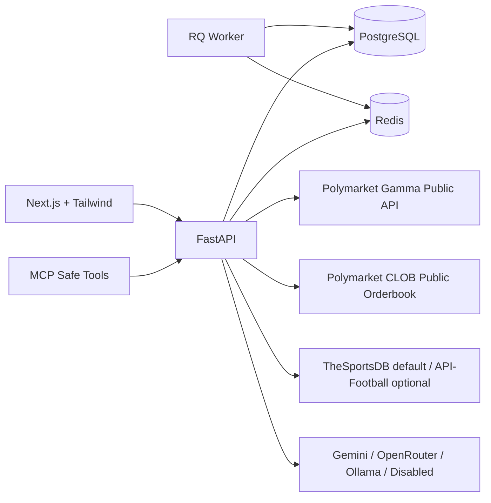

# Polymarket Soccer Edge Agent

A full-stack, paper-only soccer analysis platform for public Polymarket markets. It discovers soccer markets, normalizes inconsistent naming, estimates deterministic fair prices, explains trade setups through a conservative AI layer, and tracks simulated paper positions.

This project is intentionally built as a serious portfolio MVP: clear service boundaries, typed API contracts, Docker Compose, demo data, unit tests for the core engines, and a safe MCP server.

## What It Does

- Browses upcoming pregame soccer markets from public Polymarket data.
- Normalizes soccer market fields into a stable internal model.
- Supports moneyline / 1X2 and totals / over-under markets.
- Estimates fair probabilities with deterministic heuristics.
- Explains edge, confidence, assumptions, and risk notes.
- Places paper trades only using simulated top-of-book fills.
- Can auto paper-trade same-day soccer events with conservative thresholds.
- Settles ended events and rolls realized PnL into the portfolio after results are available.
- Tracks paper orders, fills, open positions, realized/unrealized PnL, exposure, and audit logs.
- Runs without paid APIs or model keys in demo/no-AI mode.

## Safety

This version never places real bets or live Polymarket orders.

- No authenticated Polymarket trading endpoints are implemented.
- No wallet actions, private keys, signing, or live order submission exist in v1.
- The MCP server exposes only read and paper-trading tools.
- LLMs never generate numeric fair values; all pricing numbers come from deterministic backend logic.

## Architecture



## Repository Layout

```text
polymarket-soccer-edge-agent/
  apps/
    web/                   # Next.js frontend
    api/                   # FastAPI backend
    worker/                # RQ background jobs
    mcp-server/            # safe MCP tools
  packages/
    shared-types/          # TS/Python shared shape hints
    docs/                  # architecture docs, prompts, runbooks
  infra/
    docker/
  screenshots/
  .env.example
  docker-compose.yml
```

## Quick Start With Zero Paid APIs

```bash
cd polymarket-soccer-edge-agent
cp .env.example .env
docker compose up --build
```

Open:

- Web app: `http://localhost:3000`
- API docs: `http://localhost:8000/docs`
- Health: `http://localhost:8000/health`

The default `.env.example` starts in `APP_MODE=demo`, seeds the database, disables AI calls, and uses paper trading only.

## Run Backend Locally

```bash
cd apps/api
python -m venv .venv
source .venv/bin/activate
pip install -e ".[dev]"
python scripts/init_db.py
uvicorn app.main:app --reload
```

## Run Frontend Locally

```bash
cd apps/web
npm install
npm run dev
```

## No-AI Mode

No model key is required. Keep:

```env
AI_ENABLED=false
LLM_PROVIDER=disabled
APP_TIMEZONE=America/New_York
```

The app will still produce deterministic pricing results and template-based explanations.

## Switching AI Providers

Gemini Developer API free tier:

```env
AI_ENABLED=true
LLM_PROVIDER=gemini
GEMINI_API_KEY=your_key
```

OpenRouter free models:

```env
AI_ENABLED=true
LLM_PROVIDER=openrouter
OPENROUTER_API_KEY=your_key
```

Ollama local:

```env
AI_ENABLED=true
LLM_PROVIDER=ollama
OLLAMA_BASE_URL=http://localhost:11434
OLLAMA_MODEL=llama3.1
```

If a configured provider is missing a key or unavailable, the service falls back to deterministic explanation text.

## Soccer Data Providers

Default:

```env
SOCCER_DATA_PROVIDER=thesportsdb
```

Optional API-Football adapter path:

```env
SOCCER_DATA_PROVIDER=api_football
APIFOOTBALL_API_KEY=your_key
```

The provider is abstracted through `soccer_data_client`, and demo fallback context keeps local development usable when an external provider is unavailable.

## Public Market Sync

```bash
curl -X POST http://localhost:8000/sync/polymarket
```

This calls public Polymarket discovery endpoints and public order book endpoints only. It does not authenticate.

## Main API Routes

- `GET /health`
- `GET /markets`
- `GET /markets/{market_id}`
- `GET /markets/{market_id}/orderbook`
- `GET /markets/{market_id}/analysis`
- `GET /fixtures/upcoming`
- `POST /pricing/run`
- `POST /paper-trades`
- `GET /paper-trades`
- `POST /paper-trades/auto-run`
- `POST /paper-trades/settle-ended`
- `GET /paper-trades/settlements`
- `GET /positions`
- `GET /portfolio/summary`
- `GET /risk/status`
- `GET /settings`
- `PUT /settings`
- `POST /agent/explain`
- `POST /sync/polymarket`
- `POST /sync/soccer-data`

## MCP Server

```bash
cd apps/mcp-server
npm install
API_BASE_URL=http://localhost:8000 npm run dev
```

Safe tools exposed:

- `search_soccer_markets`
- `get_market_details`
- `get_orderbook_snapshot`
- `get_team_context`
- `calculate_fair_price`
- `explain_trade_setup`
- `run_auto_paper_trader`
- `settle_ended_paper_trades`
- `list_paper_positions`
- `list_paper_settlements`
- `get_risk_status`

See `packages/docs/prompts/mcp_examples.md` for example tool prompts.

## Pricing Engine MVP

Moneyline / 1X2:

- Recent results become points-per-match form.
- Recent goal differential adjusts team strength.
- Standings rank adds a lightweight context adjustment.
- Home advantage is a fixed boost.
- Draw probability rises when teams are close.

Totals:

- Recent scoring and conceding trends estimate expected goals.
- A simple Poisson-style total-goals approximation estimates over/under probability.
- Confidence falls when data is thin, spreads are wide, or market metadata is ambiguous.

## Risk Rules

Paper trades are rejected when:

- Market is not pregame or starts inside the configured threshold.
- Liquidity is below the minimum.
- Spread is missing or too wide.
- Stake exceeds max paper stake.
- Daily exposure would exceed the limit.
- League is not whitelisted.
- Market metadata is ambiguous or missing.

## Same-Day Auto Paper Trader

The app can auto paper-trade only for soccer markets happening on the current local day defined by `APP_TIMEZONE`.

- It scans same-day pregame markets only.
- It runs deterministic pricing per outcome.
- It places paper buys only when edge and confidence clear the configured thresholds.
- It reuses the same risk engine as the rest of the platform.
- It never places a live order.

Trigger the automatic scan:

```bash
curl -X POST http://localhost:8000/paper-trades/auto-run -H "content-type: application/json" -d '{}'
```

Settle finished events and update realized PnL:

```bash
curl -X POST http://localhost:8000/paper-trades/settle-ended
```

Read settled event outcomes:

```bash
curl http://localhost:8000/paper-trades/settlements
```

## Tests

```bash
cd apps/api
pytest
```

Coverage focuses on deterministic pricing, risk validation, paper fill logic, and API smoke tests.

## Screenshots

Screenshot placeholders live in `screenshots/`. Suggested captures:

- Dashboard
- Markets list
- Market detail
- Paper portfolio
- Agent audit log
- Settings

## Roadmap

- More robust market parsing for league/team aliases.
- Historical market snapshot charts.
- Better soccer provider mapping and standings ingestion.
- Optional websocket-based public price updates.
- More detailed settlement and paper PnL closing flows.
- Live-trading research branch only after explicit safety design, feature flags, credentials isolation, and review.
