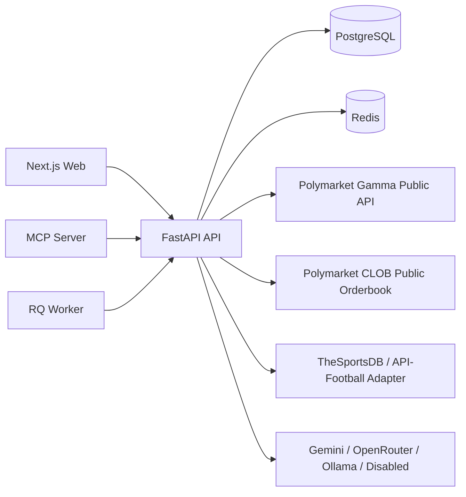

# Architecture

The platform is deliberately paper-only in v1. The Polymarket adapter exposes public discovery and order book reads only. There are no private-key, wallet, signing, order placement, or cancellation functions.

## Core Boundaries

- `polymarket_client`: public market discovery, sports metadata, public order book snapshots, and normalization.
- `soccer_data_client`: provider interface with TheSportsDB default, optional API-Football stub, and deterministic demo fallback.
- `pricing_engine`: deterministic fair probabilities. LLMs never create numeric prices.
- `risk_engine`: pregame, liquidity, spread, stake, exposure, whitelist, and metadata checks.
- `paper_trading_engine`: simulated top-of-book and limit fills, positions, and PnL.
- `ai_analysis_service`: readable thesis generation with Gemini, OpenRouter, Ollama, or disabled deterministic mode.
- `mcp-server`: high-level safe tools backed by the API.

## Safety

`PAPER_TRADING_ONLY=true` is expected for every v1 deployment. Any future live execution should be implemented in a separate module behind an explicit feature flag, code review, and user-controlled credentials.

